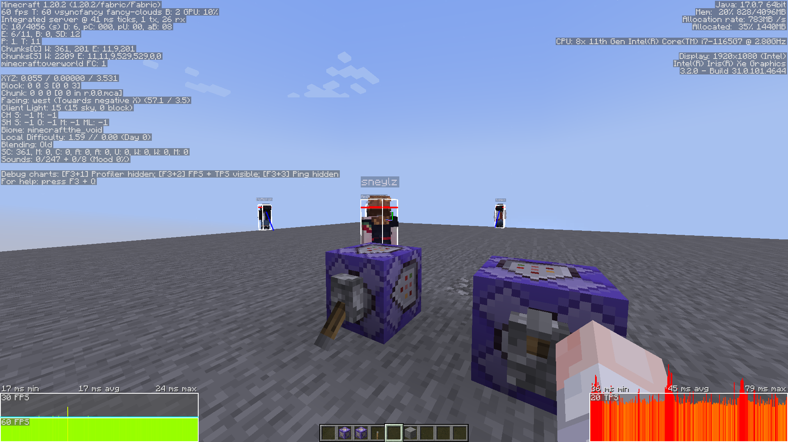
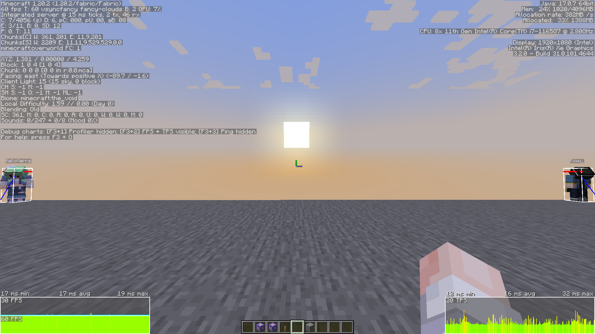
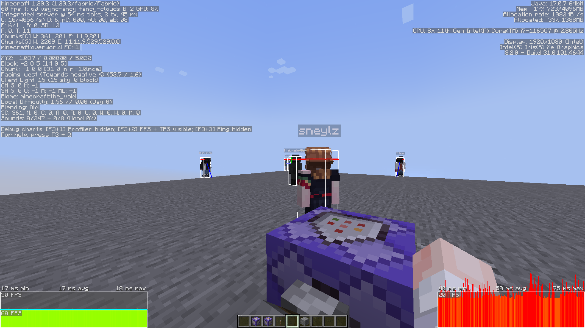

# Implementing Raymarching in MCFunction

Implementation of raymarching in MCFunction.

## Constraints

The results are compared to the vanilla raycasting algorithm. This raymarching varient has been built answering to the following constraints:
1. The main function must be called as the origin entity
2. Before the main function is called, no data must be previously gethered
3. The collision detection must be executed in a dedicated function
4. The collision detection function is never executed during the benchmarks
5. The collision detection function must be executed as the nearest entity
6. The functions must have these following stop conditions:
    - The ray has reached its maximum range
    - The ray has reached the maximum number of iterations (raymarching only)
    - The ray has reached an entity (shouldn't be true at any time during a benchmark). This is obtained by the hit detection function returning 1 if true, 0 if false.
7. No entity must be teleported (I mean, you could in both cases but it would be way less performant; this rule is to force to get the most efficient algorithms in both cases)


## Implementation

The repo includes vanilla raycasting and a raymarching implementation.
Benchmark folder includes stacked function calls to test them in game.

The raymarching function has 2 parameters:
- `.max_distance` which is the maximum range of the ray in 100th of a block
- `.max_step` which is the maximum number of iterations of the raymarching algorithm. This permits to stop the raymarch if it is really close to an entity and avoid to do a lot of iterations.


### ❔What is raymarching

Raymarching is a technique normaly used in computer graphics to render 3D scenes. Where a raycast is testing multiple points on a ray with a constant interval, raymarching is testing points on a ray with a variable interval. In other words, it takes the distance between the current point and the nearest object and use it as the step of the next iteration. This permits to have a better precision and a faster execution time.

### ➕ Advantages/Disadvantages

Raymarching is in computer graphics, a really efficient method. Tho, in MCFunction, computing a square root is really slow and could have made this raymarching implementation slower than the vanilla raycasting. 

Clearly, the day we obtain a better way to compute maths and especially complex functions, raymarching will be the best method to use in MCFunction.

Even if its best case is faster than raycasting, there is few limitations:
- Raymarching can't test blocks. It is only able to test entities.
- Raymarching has a worst case slightly slower than raycasting. More you have entities near the ray (but not touching the ray), more the raymarching will be slower than raycasting.

On the other side, there is advantages:
- Raymarching is more precise than raycasting. It is able to detect entities that are really close to the ray but not touching it. With a good hit detection function, it becomes impossible to "skip" an entity because the size separating two steps is too large.
- Raymarching is way faster than raycasting in the best case. If there is no entity near the ray, the raymarching will be faster than raycasting. This is because the raymarching will do less iterations than the raycasting.
- Raymarching permits to detect entities extremly far from its origin. Where a raycast must be limited to reasonable values, unless there will be too much iterations, the raymarching can be used to detect entities at a really long range, with only a few iterations.

## Testing

### Condtitions

The tests have been done on a 1.20.2 environment. 9 new players are spawned using `/player` command from [carpet mod](https://github.com/gnembon/fabric-carpet), fully simulating player loading.
In the world, there is an additianal entity summoned by the datapack and tagged to not be selectable by the raymarching function during its execution. Thus, there is a total of 11 entities in the world.
The simulation distance is set to 12 chunks.

The different constants are set to:
- `.max_distance` = 5000 <=> 50 blocks
- `.max_step` = 50


The raycast has only one figure case (as there is no hit detection activated) so is tested consistently.

The raymarch can be summarized to these 2 different cases:
- no entity near the ray => best case
- a lot of entities are near the ray => worst case
Thats why both are tested.

The functions used in command blocks are:
```hs
execute as Neylz run function raym:benchmark/raycast/50
```
```hs
execute as Neylz run function raym:benchmark/raymarch/50
```

The 3 tests are executed in a row. 


### Results

#### Raycast

📊 [<u>Profiling file</u>](./benchmarks/raycast.zip)

#### Raymarch
Best Case 

📊 [<u>Profiling file</u>](./benchmarks/raymarch_best.zip)

Worst Case

📊 [<u>Profiling file</u>](./benchmarks/raymarch_worst.zip)


### Analysis

*Note: Minecraft profiling (using F3+L) takes a lot of performances. The MSPT is increased by ~30%. So the results you can find in [`./benchmarks/`](./benchmarks/) are scaled up compared to the one presented in the screenshots above.*

As you can observe, the raymarching is way faster than raycasting in the best case. Tho, in its worst case, it becomes slightly slower.

So, raymarching is a good method to use if you want to detect entities at a really long range. But if you want to detect entities at a short range, raycasting is better. The final performances of raymarch will become better and better, the longer the distance is. 

Also, the raymarch doesn't permits to test the presence of blocks (which the raycast does poorly because of its step size). So if you want to detect blocks, raycasting would be better (except if you are computing and detecting through which block the ray is supposed to go through in order to avoid missing a block because a a too large step and then test block per block). 

About the "best" and "worst" cases of the raymarching. This **isn't** the real worst & best cases. The best case would be a map with no entity on it or only entities which would be selected by the raymarch.
The worst case is pottentially infinite. It would be a map with a lot of entities concentrated near the ray but not touching it. The raymarch would then do a lot of iterations and would be really slow.

These two best & worst cases i suggest are only an idea of what you can obtain in a realistic case.

## 💫 Conclusion

As a conclusion, I would say that raymarching is a really good method to use in MCFunction. It is way faster than raycasting in the best case and is able to detect entities at a really long range.

Tho, raycasting is still better in some cases.

Thats why this raymarching implementation is only a new tool and it is now up to you to choose which method is the best for your project.


---
## ❗ Notes

#### Entity origin
Note that currently, the raymarching function is taking as coordinates the origin of the entity, so for the players, the origin is located in the center of the hitbox and on their feet level.

If you want to use a the raymarching function but consider the eyes level as the origin, you can add to [`raym:raymarch/querrynearest`](./data/raym/functions/raymarch/querrynearest.mcfunction) the following line at the beginning of the function:

```diff
## get entity coords
execute store result score #e_x raym run data get entity @s Pos[0] 100
execute store result score #e_y raym run data get entity @s Pos[1] 100
execute store result score #e_z raym run data get entity @s Pos[2] 100
+ scoreboard players add #e_y raym 162
```
Calculating the nearest point of the hitbox is also possible but would require a longer run time.

#### Optimizing further the raymarching function
It is possible to use the `distance=` selector argument to optimize further the raymarching funciton. Tho, it must be implemented with the distance superiror to the maximum range of the ray. Otherwise it is required to test if an entity has been selected or not and put the distance (`#d`) to the maximum tested distance.

It hasn't be implemented in this version because it must be directly edited in the code depending of the maximum range of the ray.

Tho, it should slightly improve the raymarching function performance as explained in the [optimization guide](https://github.com/Neylz/opti-mcfunction#readme).
