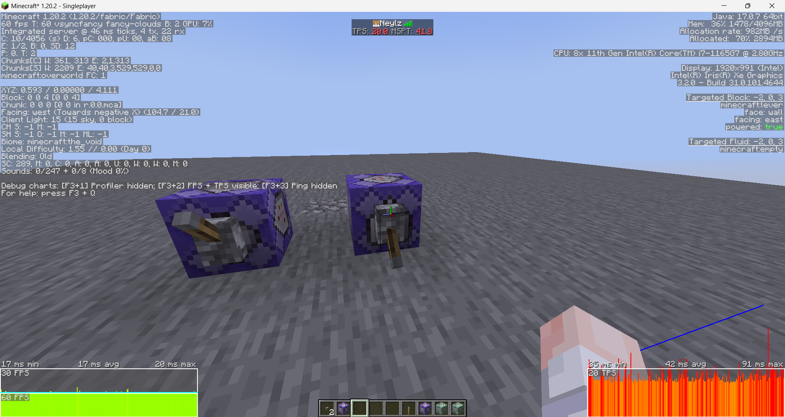
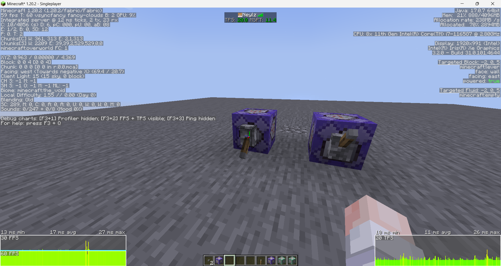

pre commit message: the following text is false, i had a bug in the raycast making it way faster than it was supposed to be. I have now to test the implementations i'm talking about below.

# Raymarching Test

Implementation of raymarching in MCFunction.

## ⚠️ Do not use in your projects

This was just a test, and isn't better than a raycast. Read more below.

## Implementation

The repo includes vanilla raycasting and a raymarching implementation.
Benchmark folder includes stacked function calls to test them in game.

## Results

Raymarching resulted getting way more slower than i was expecting. On my machine, the MSPT stabilises arround 41ms, while the raycasting version stabilises arround 12ms.

Tests were done with 50 iterations per tick, with 5 entities in the world on a maximum range of 50 blocks

----------

Note that raymarching could actually be wa

## Thoughts

I think raymarching wont get faster unless we get a faster for selecting entities. The required square root also have a considerable impact in the results. Also, the raymarching algorithm has an other big problem, it requires to use an entity which isn't required with the raycasting algorithm. Having to tp it is really slow because of the game rewriting its NBT data.

A way to improve the performances would be to compute the new coordinates of the vector directly in the raymarching function, and then use a macro to input the coordinates using `execute position $(x) $(y) $(z) as @e[type=nearest,limit=1]` but it would still be slower, especially considering the medium efficiency of macros so i didn't implemented it.

Computing the next step coordinates directly in the function would still be interesting as we have now really efficient ways to compute sine and cosine functions with reasonable precision.

For the future, it would be interesting to mix the both, implementing the raymarching first step to raycasts, skipping a lot of iterations.